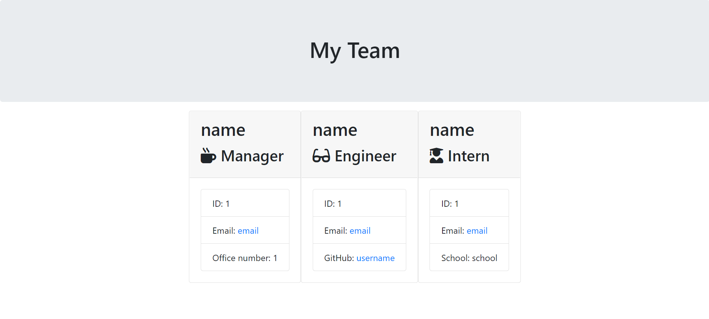

# Team Profile Generator

## Project Demo
[https://drive.google.com/file/d/16E-Cab_IZKrRsZw6BdngdWAS3R9tSg8o/view?usp=sharing](https://drive.google.com/file/d/16E-Cab_IZKrRsZw6BdngdWAS3R9tSg8o/view?usp=sharing)

## Resulting HTML from Demo Video

## Project Description

The purpose of the project was to build a command line application using Node.js. The app uses the Inquirer package to ask the user questions with the prompt method. It then takes the input and generates an HTML page to display the team info provided by the user. A secondary function of the app was to use the Jest package to run tests on the app, but that is a portion of the project I plan to revisit.